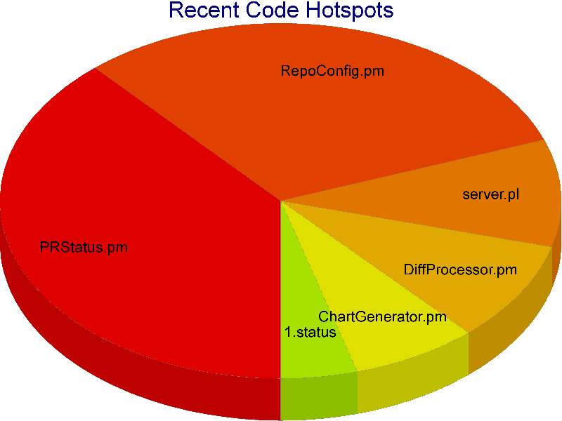
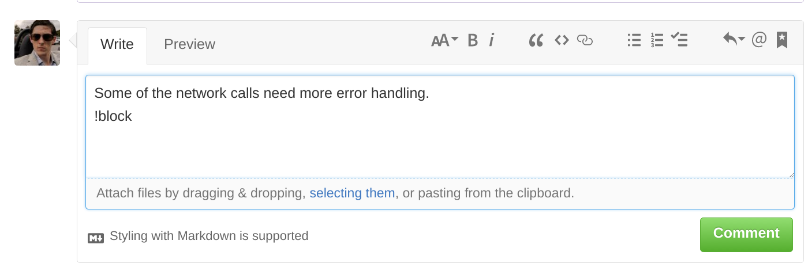
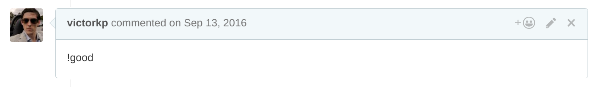
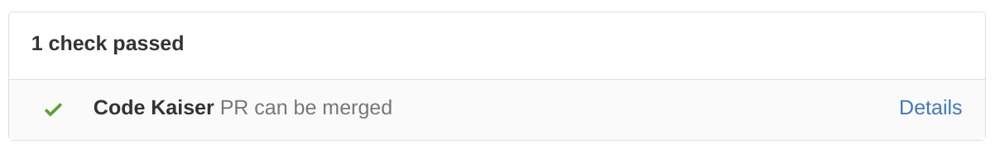
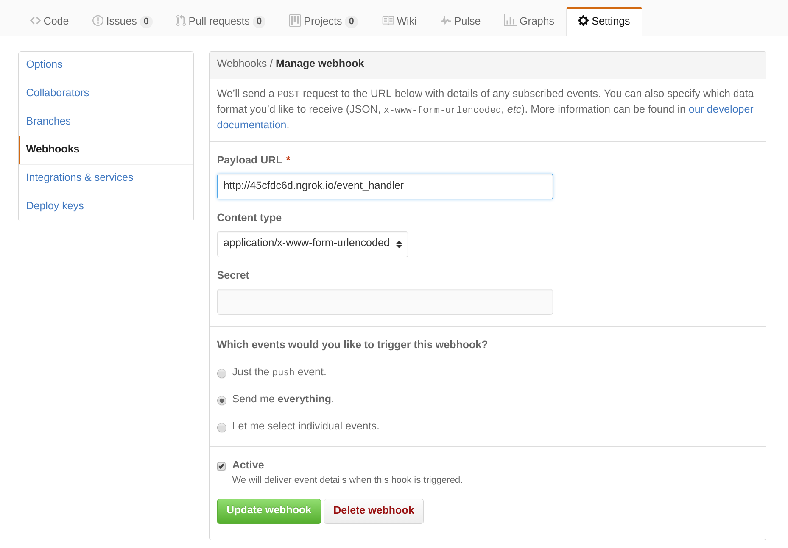
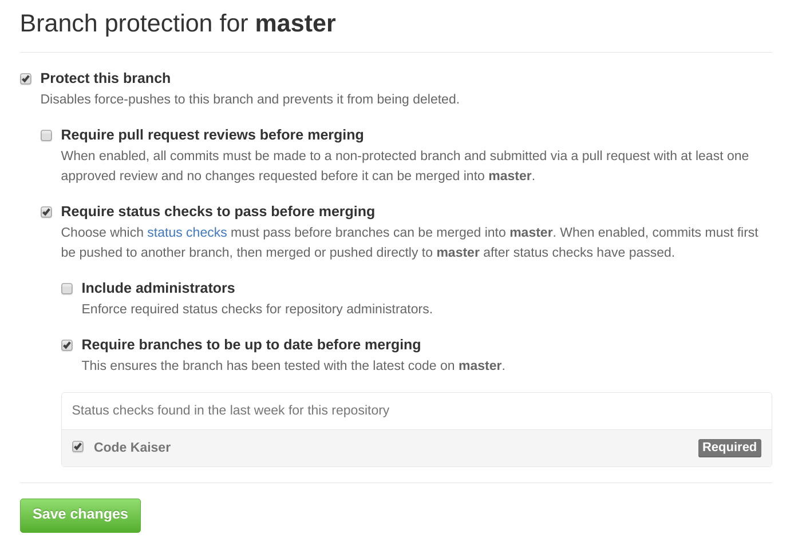

# Code Kaiser, a headless code review tool for GitHub

## Intro

Welcome to Code Kaiser, the no-nonsense headless code review tool for GitHub.

### Features
Pull Requests:
  - Comment `!block` to stop a PR from being merged
      - `!block`s can time out if not re-addressed (configurable)
  - Comment `!good` to sign off on a PR, or undo your previous block
  - A configurable number of `!good`s are needed for the Code Kaiser PR check to pass
    - E.g. require three unique teammates to sign off on a PR before merge

Code Hotspots:
  - Each merged pull request updates a model of "hot" files
  - Hot file model plugs into a pie chart generator showing which files have been most actively worked on recent PRs
  - 

### Examples

#### Blocking a PR ###

#### Allowing a PR ###

## Setup ##

1. Install dependencies: `sudo make install-dependencies` (non-RedHat distros need to switch from DNF to CPAN, see Makefile)
2. Setup your repo in `data/<repo-owner-username>/<repo-name>/repo.config`
   - Make a GitHub user access token if you haven't already
   - See `data/victorkp/code-kaiser/repo.config` example
3. Setup a GitHub webhook for your repo, so that your Code Kaiser instance recieves events from GitHub:
   - If you have a public IP, great! CodeKaiser defaults to port 8080
   - Otherwise, you can use ngrok. Install ngrok, and run `make ngrok` to start it, then use your ngrok forwarding URL:
   - 
4. Create a pull request! This finishes setup of CodeKaiser and allows you to complete the next step
5. Setup GitHub protected branches, to force CodeKaiser checks to succeed before allowing a merge
   - 
6. You can monitor your hotspot files in `data/<repo-owner>/<repo-name>/output/`, which contains small and large `.png` outputs, as well as an `html` snippet and a CSV

## Future Work

Short term:
  - Automated end to end testing
  - More robust `!block` timeouts (check on a timer)
  - More unit testing

Long term goal: static code analysis (perhaps with a convolutional neural net) 

Bad Code Detection Goals
  - Code is unreadable (maybe not enough comments?)
  - Subroutine is very long
  - Subroutine has duplicate structure to another
  - Presence of `TODO`
  - Exceptions caught but not acted upon
  - Dangerous use of reflection (Java)
  - Confusing/non-distinct naming
  - Not checking for null arguments (unless @NonNull)
  - Thread doesn't handle interruption (`InterruptedException` or `Thread.interrupted()`)
  - Bad use of data structure
    - Searching through List
    - Iterating through Map

